# Clinical Rules Engine: Reviewer Architecture

## At a Glance

This application turns patient facts into program enrollments and patient and task lists for staff. The backend separates ingestion, rules, storage, and API endpoints. Rules use immutable domain objects and an explicit evaluation date, independent of the database and API.

The supplied CSV snapshot contains 300 patients. At `2026-04-07`, the pipeline produces 288 Primary Care Wellness enrollments, 115 Diabetes Management enrollments, 154 scheduling tasks, and 119 referral tasks. Patients may qualify for both programs.

## Stack and Data Flow

```mermaid
flowchart TB
  CSV["CSV files"]

  subgraph Backend["Backend"]
    direction TB
    Ingest["Ingestion pipeline"]
    Repo["SqlRepository"]
    DB[("SQL database")]

    subgraph Evaluation["Per-patient evaluation"]
      direction TB
      Context["PatientContext (all facts for given patient)"]
      Engine["RulesEngine(as_of)"]
      Enrollments["Enrollment results"]
      Needs["Care needs"]
      Resolver["Task resolver"]
      Tasks["Generated tasks"]
      Context --> Engine
      Engine --> Enrollments
      Engine --> Needs --> Resolver --> Tasks
      Context --> Resolver
    end

    Ingest --> Evaluation
    Ingest -->|Persist source facts| Repo
    Enrollments -->|Persist enrollments| Repo
    Tasks -->|Persist tasks| Repo
    Repo ---|SQL reads and writes| DB
  end

  subgraph Presentation["API and frontend"]
    direction TB
    API["FastAPI app"]
    UI["React frontend views"]
    API -->|Frontend queries patient and task data| UI
  end

  CSV --> Ingest
  Repo -->|API reads patient and task data| API
```

CSV ingestion and evaluation currently run synchronously before API startup. Bounded patient batches and background workers are future options for larger populations.

Key code: [pipeline bootstrap](backend/app/pipeline/bootstrap.py), [orchestrator](backend/app/pipeline/orchestrator.py), [rules engine](backend/app/engine/rules_engine.py), [repository](backend/app/repository/sql.py), and [API](backend/app/api/main.py).

## Application Data Model

### Facts and evaluation objects

The ingestion adapter parses patients, diagnoses, labs, and encounters into immutable dataclasses. A `PatientContext` groups one patient with their facts. Missing diagnoses, labs, or encounters are empty collections, so the rules don't need database-specific checks.

### Programs, needs, and tasks

The processing model has three distinct concepts:

1. A **program** checks eligibility, assigns a risk tier, and builds care needs. `RulesEngine.evaluate_patient()` runs each program independently, so a patient can enroll in more than one.
2. A **need** describes recommended care, such as an Endocrinology visit every 90 days. It records the program, `need_type`, specialty, cadence, and whether the visit is with a specialist. The `Need` object is temporary and has no table of its own.
3. A **task** is generated from a need and the patient's encounter history. It preserves program provenance and stores `need_type`, specialty, task type, and reason. Current task types are `scheduling` and `referral`. Overlapping needs from different programs are not deduplicated.

### SQL schema

SQLAlchemy defines the following tables in [repository/models.py](backend/app/repository/models.py):

The first four tables are populated from `patients.csv`, `diagnoses.csv`, `labs.csv`, and `encounters.csv`. The `patients` table omits the CSV's `phone` field, which the loader does not use. SQL types below are inferred by SQLAlchemy from the mapped Python types.

| Table           | Columns and SQL types                                                                                                                                                          | Keys and relationships                                                            |
| --------------- | ------------------------------------------------------------------------------------------------------------------------------------------------------------------------------ | --------------------------------------------------------------------------------- |
| `patients`      | `patient_id VARCHAR` `first_name VARCHAR` `last_name VARCHAR` `date_of_birth DATE` `gender VARCHAR` `language VARCHAR NULL` `pcp_provider_name VARCHAR NULL` | Primary key: `patient_id`.                                                        |
| `diagnoses`     | `id INTEGER` `patient_id VARCHAR` `icd_code VARCHAR` `description VARCHAR` `diagnosed_date DATE`                                                                   | Primary key: `id`. Foreign key: `patient_id` references `patients.patient_id`. |
| `labs`          | `id INTEGER` `patient_id VARCHAR` `test_name VARCHAR` `result_value DOUBLE` `result_date DATE`                                                                     | Primary key: `id`. Foreign key: `patient_id` references `patients.patient_id`. |
| `encounters`    | `id INTEGER` `patient_id VARCHAR` `specialty VARCHAR` `encounter_date DATE` `provider_name VARCHAR`                                                                | Primary key: `id`. Foreign key: `patient_id` references `patients.patient_id`. |
| `enrollments`   | `id INTEGER` `patient_id VARCHAR` `program VARCHAR` `risk_tier VARCHAR`                                                                                               | Primary key: `id`. No patient foreign key.                                     |
| `tasks`         | `id INTEGER` `patient_id VARCHAR` `program VARCHAR` `need_type VARCHAR` `specialty VARCHAR NULL` `task_type VARCHAR` `reason VARCHAR`                        | Primary key: `id`. No patient foreign key.                                     |
| `pipeline_runs` | `id INTEGER` `as_of DATE` `created_at DATETIME`                                                                                                                          | Primary key: `id`.                                                                |

`SqlRepository` maps rows to domain objects before evaluation. Each operation uses its own SQLAlchemy session. One patient's enrollments and tasks are replaced in a single transaction, but a full ingest isn't atomic: facts commit first, each patient's results commit separately, and the run date is recorded last.

## Rule Evaluation and Edge Cases

Rules use an explicit `as_of` date, not the current date. The default is the latest lab date, `2026-04-07`. Ingestion accepts `--as-of` to choose another date. This makes historical evaluations repeatable and keeps future facts from affecting past results.

- **Primary Care Wellness:** eligible from age 18. Patients 65 or older, or with a qualifying diagnosis dated on or before `as_of`, are High Priority (180-day cadence). Other eligible patients are Standard (365 days).
- **Diabetes Management:** an E10/E11 diagnosis dated on or before `as_of` qualifies at any age. Risk comes from the latest A1C in the inclusive 180-day window: High at 9.0+, Moderate at 7.0 to below 9.0, Low below 7.0, or Unmonitored with no recent result. For same-day results, the higher value wins.
- **Missing information:** without a qualifying diagnosis, there is no Diabetes Management enrollment. Without a recent A1C, an eligible patient is Unmonitored. No encounter history means no PCP task, but a specialist referral if there is no future visit.
- **Visit history:** a future encounter for that specialty suppresses a task. Otherwise, scheduling is generated only when the latest prior visit is more than the cadence ago. A visit exactly at the limit is not overdue. No specialist history generates a referral.

## Extensibility

### Adding a program

Implement `ProgramRule`'s `is_eligible`, `determine_risk`, and `build_needs` methods in a module, then add it to `default_programs()`. Programs using existing facts and need fields require no schema change.

### Adding a need type

A `need_type` selects a resolver in [engine/tasks.py](backend/app/engine/tasks.py). A new resolver can reuse `Need` and `Task`. New fields or a different stored payload may also require domain, SQL, or API changes. Only `visit_cadence` exists today.

### Scaling the rules

`run_patient` currently handles one patient and could be queued through Celery or TaskIQ using patient IDs and `as_of` dates. Workers can group patients into bounded batches and batch database reads and writes to reduce queue and repository overhead. Each worker creates its own repository. A periodic scheduler should also reevaluate patients as visits become due, even when no new data arrives.

## Ingestion and Growth Path

The CSVs are only the assignment's input. A production system could use the same ingestion boundary with a scheduled extract, vendor API, or data sourced from an EHR. An adapter would map incoming data to the existing fact model, keeping the rules independent of its source. This is a possible extension, not part of the current implementation.

The current batch path loads the full CSV dataset and patient-ID list into memory, then queries and writes results one patient at a time. That works for 300 patients, but not for millions of records. Larger backfills should stream and bulk-load facts in bounded batches. Ongoing updates can reevaluate only changed patients.

For ongoing updates, make writes idempotent and protect against stale source versions. `/tasks` filters run in SQL. `/patients` selects matching patient IDs in SQL, then loads enrollments and tasks only for that page. Both endpoints use cursor pagination with a default page size of 50 and a maximum of 100. Responses include `items` and `next_cursor`, and the frontend lets users load the next page.

## API and Frontend

FastAPI exposes `/health`, `/patients`, `/specialties`, and `/tasks`. Schedulers see scheduling tasks, while the clinical role sees scheduling and referrals.

The React/TypeScript frontend has patient and task views with shared filters. It loads the reference date and specialties, and uses a Load more button to fetch the next page. Changing roles clears the other filters, and old requests are cancelled or ignored.

## Decisions and Tradeoffs

| Decision                                 | Benefit for this assignment                                                                                    | Cost or production follow-up                                                                                                                          |
| ---------------------------------------- | -------------------------------------------------------------------------------------------------------------- | ----------------------------------------------------------------------------------------------------------------------------------------------------- |
| Rules defined in code                    | Easy to review and test alongside the application.                                                             | Rule changes require a deployment. Data-driven rules could change faster, but need validation and audit controls.                                     |
| Pure rules over immutable domain objects | Deterministic evaluation. Rules don't depend on external dependencies.                                         | Adapters must normalize source semantics.                                                                                                             |
| Program / need / task separation         | Programs can be added independently. Needs reuse task-generation logic, and tasks preserve program provenance. | New need types still require a registered resolver. There is no general workflow engine or cross-program deduplication currently.                     |
| Sequential patient-level processing      | Simple to operate. Each patient's results are replaced atomically.                                             | Per-patient database calls limit throughput. Bounded batches and background workers could reduce repeated I/O and distribute independent evaluations. |
